## 🚬 Tobacco Use & Mortality Risk Prediction (2004–2015)

A Machine Learning + Data Science project that analyzes how tobacco usage patterns, economic factors, and healthcare indicators influence mortality risk, and provides a live prediction web app.

# 🌍 Live Deployment

🚀 Live Streamlit App

Try the app here:  
👉 https://tobacco-mortality-ml-3fdh5bpujset8xltm8srw4.streamlit.app/

⚡ FastAPI Backend: http://127.0.0.1:8000

# 📌 Problem Statement

Tobacco use is one of the leading causes of preventable deaths worldwide.
This project aims to:

✔ Analyze trends in smoking behavior and economic factors

✔ Understand relationships with hospital admissions and mortality

✔ Build a Machine Learning model to predict high vs low mortality risk

✔ Provide explainable AI insights using SHAP

✔ Deploy an interactive web app for real-time predictions

# 📊 Datasets Used

Data covers England (2004–2015)

Dataset	Description
Admissions	Hospital admissions linked to smoking-related diseases
Fatalities	Mortality statistics
Smokers	Smoking prevalence by age groups
Prescriptions	Tobacco cessation medication prescriptions
Metrics	Tobacco prices, affordability, and income indicators

# ⚙️ Project Workflow

1️⃣ Data Cleaning

Standardized year formats

Converted columns to numeric

Handled missing values

Removed inconsistencies

2️⃣ Data Integration

Merged multiple datasets into a unified yearly dataset containing:

Smoking prevalence

Admission rate

Mortality rate

Tobacco affordability

Income impact

Prescription usage

3️⃣ Feature Engineering

Created meaningful features:

Smoking Duration Proxy

Smoking Trend

Admission per Smoker

Mortality per Smoker

Prescription per Smoker

Affordability Impact

Income Impact

## 📊 Exploratory Data Analysis

### 🔹 Distribution of Key Variables
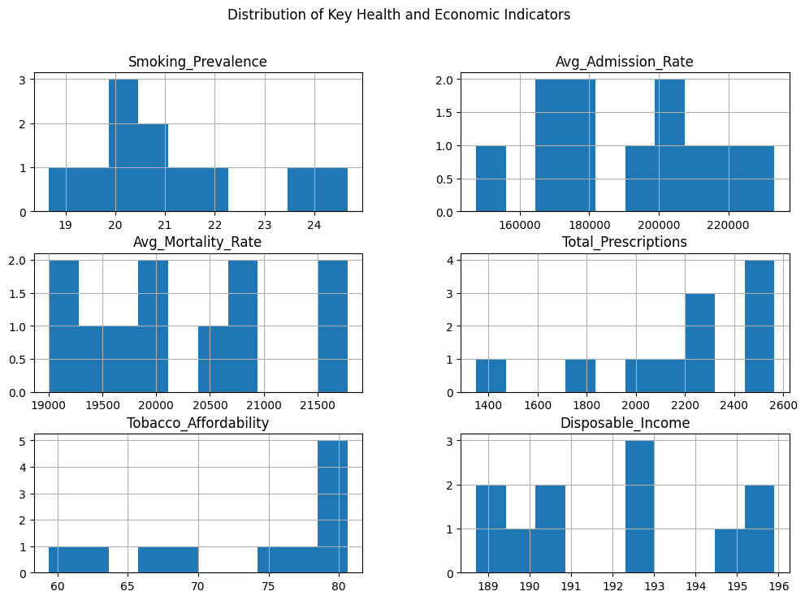

### 🔹 Smoking vs Mortality
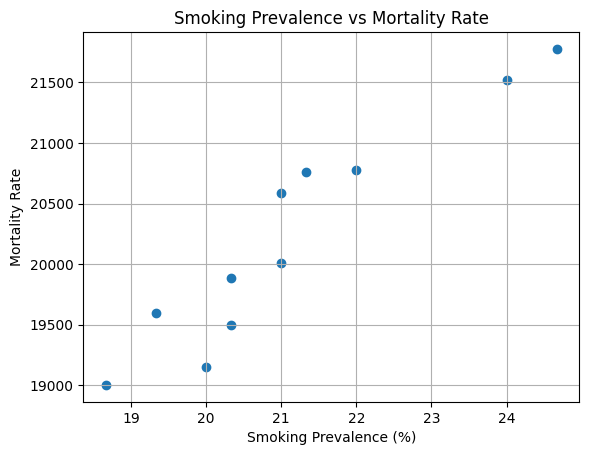

### 🔹 Smoking vs Admission Rate
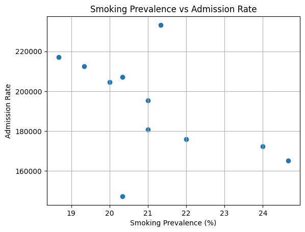

### 🔹 Tobacco Affordability vs Smoking
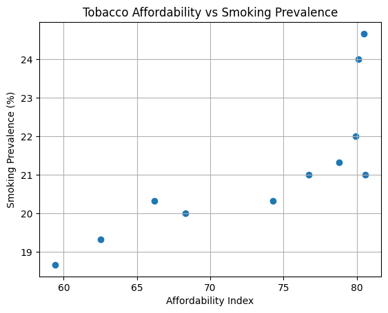

### 🔹 Trends Over Time
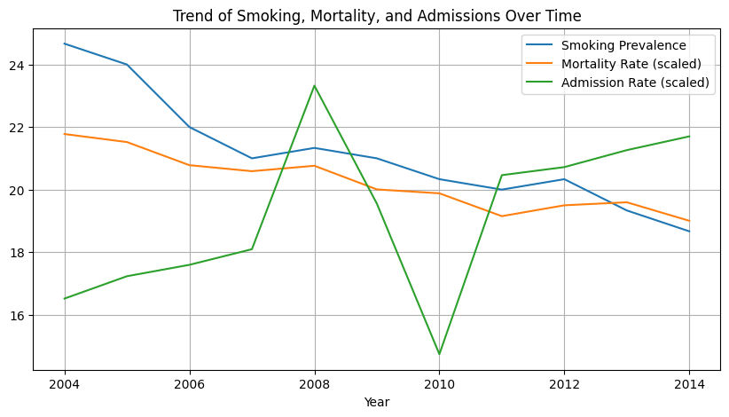

### 🔹 Tobacco Price vs Smoking Trend


### 🔹 Correlation Heatmap
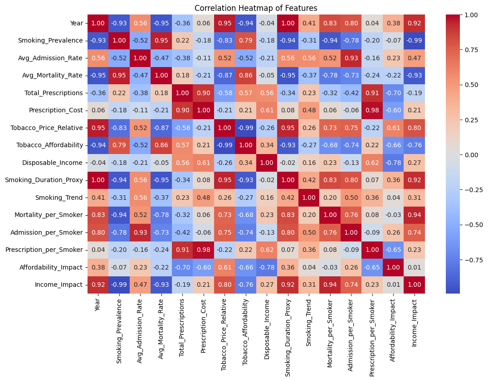

### 🔹 Correlation with Mortality
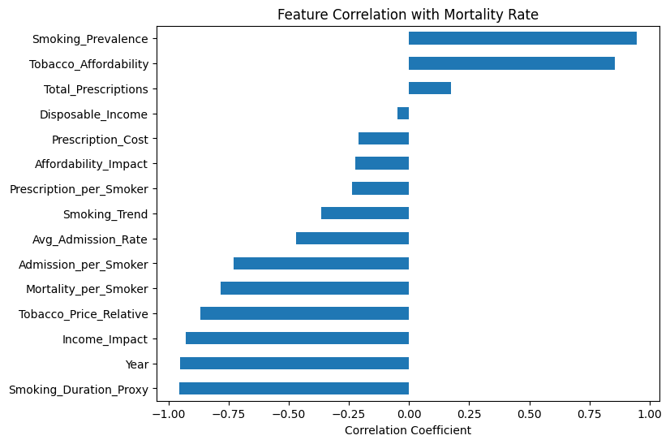

## 🤖 Machine Learning Models

Target variable:

High_Mortality

1 → Above median mortality rate

0 → Below median mortality rate
```
| Model               | Accuracy |
| ------------------- | -------- |
| Logistic Regression | 75%      |
| SVM                 | 75%      |
| Random Forest       | 100%     |  
| Gradient Boosting   | 100%     |

As dataset is small, so accuracy is high for last two models.
```

🏆 Final Model Selected: Random Forest

## 🧠 Model Evaluation

### Confusion Matrix
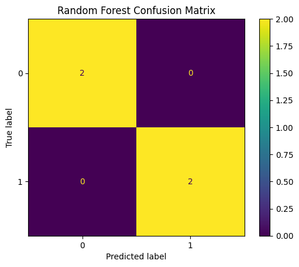

### ROC Curve
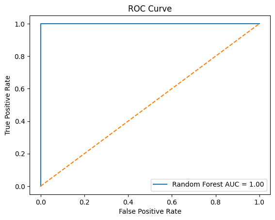


## 🔍 Model Interpretation

### Feature Importance (Random Forest)
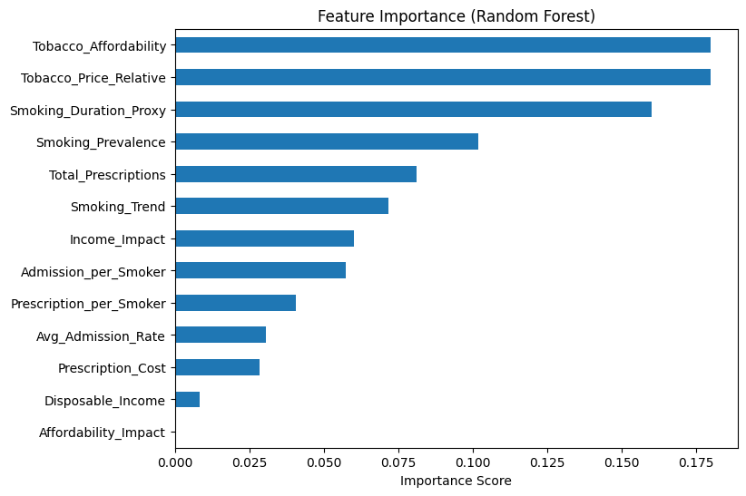

### SHAP Explainability
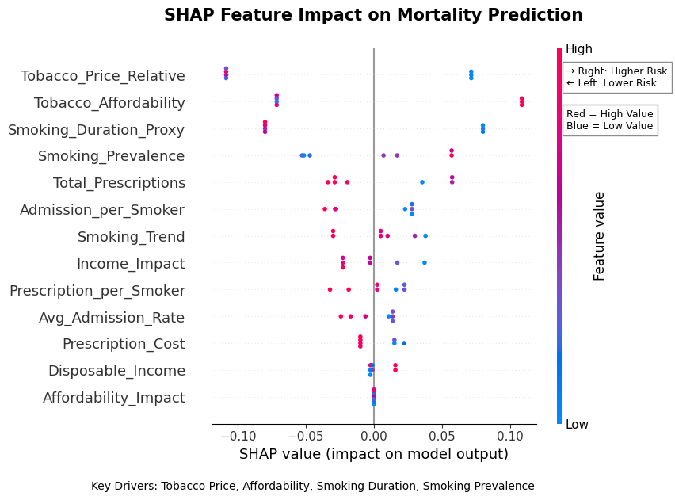


### 🔑 Top Risk Drivers Identified
```
| Feature                      | Impact on Mortality                     |
|------------------------------|-----------------------------------------|
| Tobacco Price Relative Index | Higher price → Lower mortality          |
| Tobacco Affordability        | Higher affordability → Higher mortality |
| Smoking Duration Proxy       | Longer exposure → Higher mortality      |
| Smoking Prevalence           | Higher prevalence → Higher mortality    |
```

## 🌐 Deployment

### 🖥 Streamlit Web Application

Users input smoking and economic indicators to receive real-time mortality risk predictions.

#### 🟢 Low Risk Example


#### 🔴 High Risk Example


### ⚡ FastAPI Backend

Run locally:
```bash
uvicorn api:app --reload
```

API Running Example:
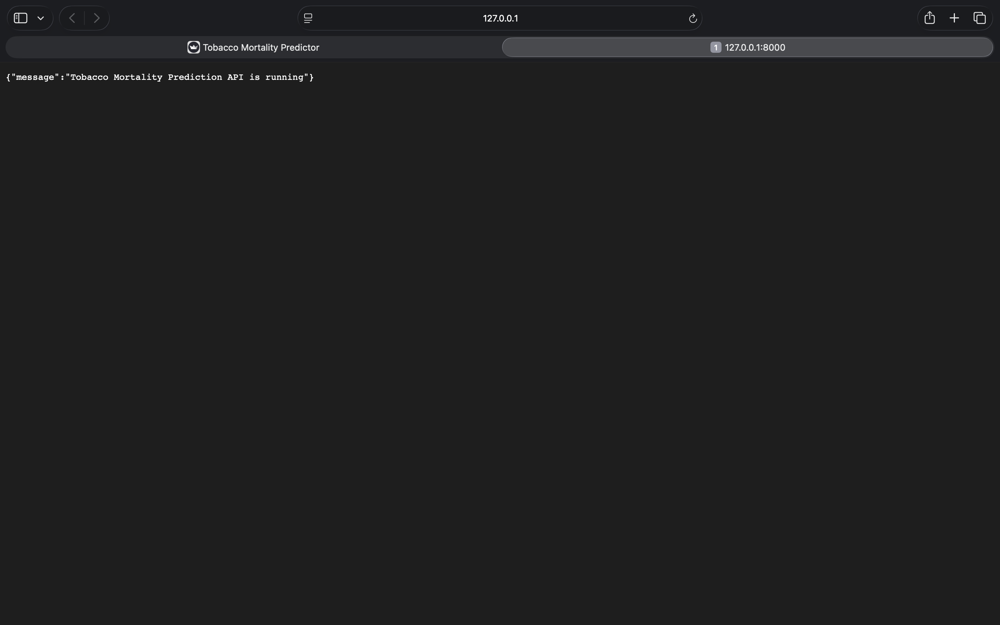


## 🛠 Tech Stack

Python
Pandas / NumPy
Scikit-learn
SHAP
Matplotlib / Seaborn
Streamlit
FastAPI

## 🚀 How to Run Locally
```
git clone https://github.com/vishalrox/tobacco-mortality-ml.git

cd tobacco-mortality-ml

python -m venv venv

source venv/bin/activate  # Mac/Linux

pip install -r requirements.txt

streamlit run app.py
```

## 📌 Future Improvements

Use larger population-level datasets

Add time-series mortality forecasting

Integrate live public health datasets

Deploy automated model monitoring

👨‍💻 Author

Vishal Mehta
Machine Learning • Data Science • AI Projects

⭐ If you found this project useful, consider starring the repo!
